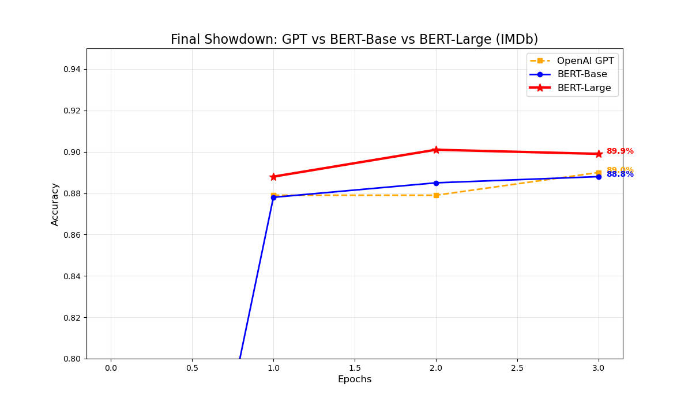

# BERT: Pre-training of Deep Bidirectional Transformers for Language Understanding


## 📌 Project Overview
이 저장소는 **BERT (Devlin et al., 2018)** 논문을 깊이 있게 분석하고, 실제 코드 구현을 통해 그 성능을 검증한 스터디 기록입니다.

크게 두 가지 파트로 구성되어 있습니다:
1.  **Paper Review:** 논문의 핵심 아이디어(MLM, NSP, Architecture) 정리 및 발표 자료 제작.
2.  **Implementation:** IMDb 감성 분석 태스크를 통해 BERT와 GPT의 성능을 직접 비교 실험.

<br>

## 📚 Part 1. Paper Review (PDF)
제가 직접 작성하고 정리한 BERT 논문 분석 발표 자료입니다. 아래 링크를 클릭하면 전체 내용을 확인하실 수 있습니다.

> **[📄 발표 자료 보러가기 (Click to View PDF)](./BERT%20Pre-training%20of%20Deep%20Bidirectional%20Transformers%20for%20Language%20Understanding_paper_study.pdf)**

### 💡 Key Takeaways
* **Bidirectionality:** 기존 단방향(GPT)이나 Shallow Bidirectional(ELMo) 모델과 달리, 모든 레이어에서 양방향 문맥을 참조하는 **Deep Bidirectional** 구조를 제안.
* **Pre-training Tasks:**
    * **Masked LM (MLM):** 입력의 15%를 가리고 예측하며 문맥을 학습.
    * **Next Sentence Prediction (NSP):** 두 문장의 관계를 파악하는 능력 학습.
* **Feature-based vs Fine-tuning:** BERT는 Fine-tuning뿐만 아니라, 임베딩만 추출하여 사용하는 Feature-based 방식에서도 SOTA 급 성능을 보임.

<br>
<hr>
<br>

## 📊 Part 2. Experimental Results (BERT vs GPT)
실제 IMDb 영화 리뷰 데이터셋(50k)을 사용하여 단방향 모델(OpenAI GPT)과 양방향 모델(BERT)**의 성능 차이를 검증했습니다.

### 1. Training Setup
* **Task:** Sentiment Analysis (Binary Classification)
* **Dataset:** IMDb Movie Reviews
* **Models:**
    * `OpenAI GPT` (110M params, Unidirectional)
    * `BERT-Base` (110M params, Bidirectional)
    * `BERT-Large` (340M params, Bidirectional)

### 2. Final Result Graph
**[실험 결과 요약]**
학습 진행(Epoch)에 따른 정확도(Accuracy) 변화 그래프입니다.

<p align="center">
  
</p>

### 3. Quantitative Results (Accuracy)
| Model | Epoch 1 | Epoch 2 | Epoch 3 (Final) |
| :--- | :---: | :---: | :---: |
| **OpenAI GPT** | 87.9% | 87.9% | 89.1% |
| **BERT-Base** | 87.8% | 88.5% | 88.8% |
| **BERT-Large** | **88.8%** | **90.1%** | **89.9%** |

* **Observation:** BERT-Large 모델이 가장 높은 성능을 보였으나, 3 Epoch에서 과적합(Overfitting)으로 인해 성능이 소폭 하락함.

### 4. Analysis
* **BERT의 승리:** 동일한 파라미터 수(110M)를 가진 `BERT-Base`가 `OpenAI GPT`보다 높은 성능을 기록했습니다. 이는 감성 분석 태스크에서 **양방향 문맥 파악**이 얼마나 중요한지를 증명합니다.
* **Size Matters:** 모델 크기를 키운 `BERT-Large`는 압도적인 성능(약 89.9%)을 보여주었습니다.
* **Overfitting 이슈:** `BERT-Large`의 경우 3 Epoch에서 성능이 소폭 하락했는데, 이는 모델이 너무 강력하여 학습 데이터에 과적합(Overfitting)되기 시작했음을 시사합니다. (논문 권장 Epoch: 2~4회)

<br>

## 🚀 How to Run
본 프로젝트의 실험 코드를 실행하기 위한 가이드입니다.

### 1. Install Dependencies
필요한 라이브러리를 설치합니다. `requirements.txt`를 이용하면 한 번에 설치할 수 있습니다.

```bash
pip install -r requirements.txt
